# TOPIC MODELLING ANALYSIS ON KOREAN POP LYRIC(R version)
본 프로젝트는 한국어 가사 텍스트를 대상으로 하는 토픽 모델링 자동 분류 효과를 테스트하기 위한 것이다. 데이터 소스는 [MELON](https://www.melon.com/)에서 "사랑" 키워드로 검색된 5000건 이상의 가사 원본 텍스트이며, 사용하는 모형은 LDA와 STM이다. 모형의 훈련 환경은 `R 3.9.*`이다.

## INTRODUCTION
In Korea, popular songs could be a very important way for people to express their "love" feelings, which inspired many researchers to excavate the hidden connections between humans’ love perception and popular songs with different genres based on the lyrics with "love-centered" keywords. Traditionally, a qualitative analysis of "love-centered" lyrics should focus on several typical instances extracted from the whole samples, generalizing the characteristics of a specific writer or brief period. However, with the development of computer science and statistics, it now provides a new perspective for us to elucidate the true meanings behind the natural language texts without human beings’ subjective interpretations. This quantitative analysis method, on the one hand, can efficiently relieve the manual classification burdens and generate a more precise sorting result even than human beings' doing. On the other hand, the rigidly quantized classification criteria sometimes can also incur several enigmatic conclusions conflicting with people's intuitional judgment. To demonstrate the practicability of it, this paper hence chose to manipulate 5082 Korean "love-centered" lyrics collected from online with 2 kinds of considerably valuable "topic models": LAD & STM, aimed to 1. verify the feasibility of automatically constructing a taxonomy system of "love-centered" lyrics; 2. examine and speculate a diachronic correlation between "love-centered" lyrics and published years. As a result, it is of great necessity to optimize the themes K selection when conducting a topic modeling experiment. And based on a reasonable classification, it is possible to observe a significant regressive trend on different groups of "love-centered" lyrics through years. But because of the performance limitation of topic modelling, there are still some biased cases that can be found, which implies a further improvement not just on technical parameter testing but also on a potential collaboration between quantitative and qualitative analysis.

## PROCESS
### Data Collection
1. 온라인 가사 검색 엔진(MELON)에서 핵심어 “사랑” 입력 후 여과 설정에 “가사”만 선택.
2. 검색 결과 총수 및 노래 가사 URL 확인(“songid” 목록에 저장).
3. 각 가사 URL에 개별 접속을 통해 “노래 제목”, “음반 제목”, “발매 시간”, “장르”, “가수 이름”, “작사가 이름”, “좋아요 수”, “가사” 총 8가지 정보 수집.
4. 만약 위 8종류 정보 중에 밝히지 않는 부분이 있으면, 일단 “NULL”으로 저장.
5. 발매 시간에 대해, 기존의 연/월/일(2000.1.1) 형태를 모조리 연-월-일(2000-1-1)로 변경; 만약 연도만 있고 구체적인 월, 일 정보가 없을 경우, 일제히 1월1일(01-01)로 채움; 만약 연도조차 불투명한 경우, 일제히 1970년 1월 1일(1970-01-01)로 채움.
6. 노래 가사 부분에 대해 재점검; 우선 한국어로 된 노래 가사만 선별한 후에 중복된 항목들을 일제히 삭제. 노래 가사 중에 띄어쓰기나 맞춤법 오류 등 문제에 원칙적으로 추가 교정 안함.

**Code:** [lyrics3.R](./codes/lyrics3.R "코드 상반부 참조")

**Details for manual filtering:**
* 자동 검색 결과 수: 9985 (MELON 사이트에서 "사랑" 키워드로 검색된 가사 총수.)
- 1차 점검 후 개수: 8818 (R로 완전 일치 항목들을 일제히 제거.)
- 2차 점검 후 개수: 6628 (엑셀에서 "lyrics" 란을 위주로 중복된 항목 제거.)
- 3차 점검 후 개수: 6511 (엑셀에서 "lyrics" 란에 영어나 일본어 등 외국어 가사 및 기타 부적절한 항목(가사가 너무 짧거나 이상한 것) 제거.)
* 4차 점검 후 개수: 5082 (공백, 띄어쓰기, 문장 반복 등 차이로 인해 전에 검출하지 못한 "lyrics" 중복 항목들을 마지막 수동 검사 후 제거.)

### Text Preprocessing
1. “lyrics” 항목에 저장한 모든 가사 내용을 하나씩 추출한 후 하나의 TXT로 묶음.
2. UTAGGER 프로그램에서 가사 TXT 파일을 불러온 후 형태소 자동 주석 진행.
3. UTAGGER 분석 결과를 “lyrics_tag” TXT 파일로 저장한 후에 R로 다시 불러들임.
4. R에서 형태소 단위 별로 POS주석 정보에 따라 각 가사 내용의 실질적 형태소 부분만 추출. (실질적 형태소 범위: 명사NN, 동사VV, 형용사VC/MM, 부사MA; 감탄사IC는 예외로 포괄했음)

**Tool:** [Utagger](http://nlplab.ulsan.ac.kr/doku.php?id=utagger "stop")

**Example for lyrics auto-tagging:**
* raw lyric: "사랑 그 사랑 때문에. 그 사람 때문에. 내가 지금껏 살아서. 오늘 오늘이 지나서. 그 사람 다시 볼 수 없게 되면. 다시 볼 수 없게 되면 어쩌죠. 그 많은 인연에 왜 하필. 우리 만나서. ---임재범(2013) <사랑>"
- pos tags: "사랑__01/NNG 그__01/MM 사랑__01/NNG 때문/NNB+에/JKB+./SF+그__01/MM 사람/NNG 때문/NNB+에/JKB+./SF+내__04/NP+가/JKS 지금껏/MAG 살__01/VV+아서/EF+./SF+오늘/NNG 오늘/NNG+이/JKS 지나/VV+아서/EF+./SF+그__01/MM 사람/NNG 다시__01/MAG 보__01/VV+ㄹ/ETM 수__02/NNB 없__01/VA+게/EC 되__01/VV+면/EF+./SF+다시__01/MAG 보__01/VV+ㄹ/ETM 수__02/NNB 없__01/VA+게/EC 되__01/VV+면/EC 어쩌__01/VV+죠/EF+./SF+그__01/MM 많/VA+은/ETM 인연__03/NNG+에/JKB 왜__02/MAG 하필__02/MAG+./SF+우리__03/NP 만나/VV+아서/EF+./SF"
* selected morphemes: "사랑 그 사랑 그 사람 내 지금껏 살 오늘 오늘 지나 그 사람 다시 보 없 되 다시 보 없 되 어쩌 그 많 인연 왜 하필 우리 만나"

### Topics "K" Optimization
**K selection in STM:**
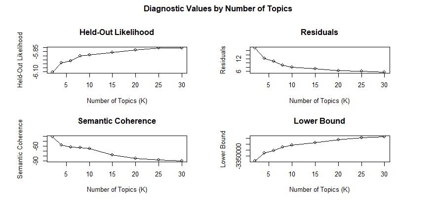

**K selection in LDA:**
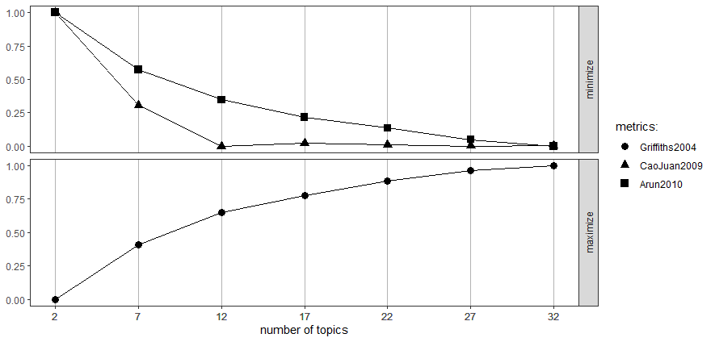

**Code for "K" Optimization(LDA):** [topicmodels_k_opt.R](./codes/topicmodels_k_opt.R "stop")

### Model Training
* **Code for STM:** [lyrics3.R](./codes/lyrics3.R "코드 마지막 부분 참조")
- **Code for LDA:** [text2vec.R](./codes/text2vec.R "코드 상반부 참조")
* **Graphing for LDA result:** [text2vec.R](./codes/text2vec.R "코드 후반부 참조")

## RESULTS

### LDA:
#### Total:
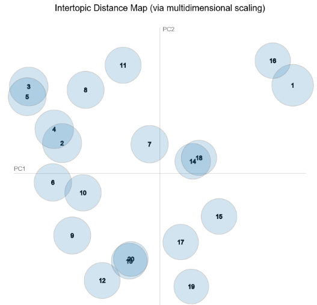
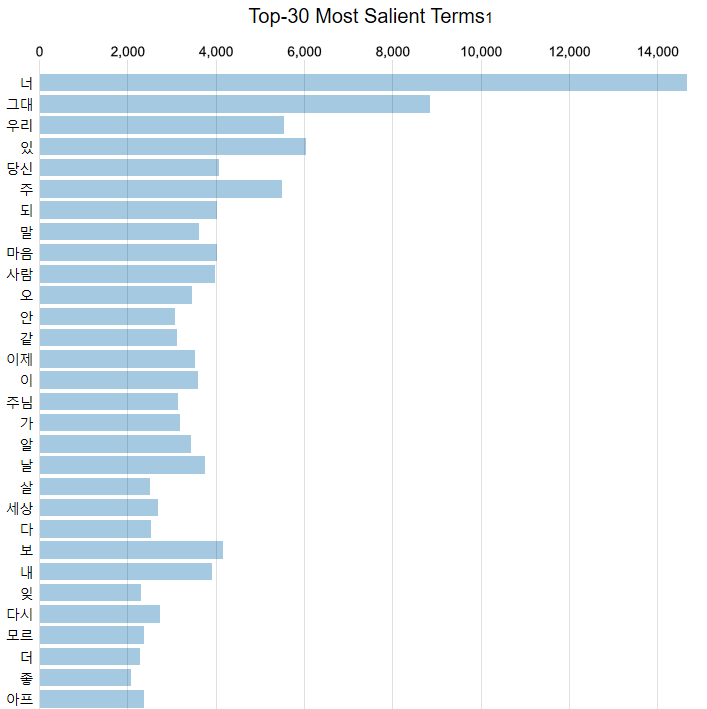

#### Topic 1 in LDA:
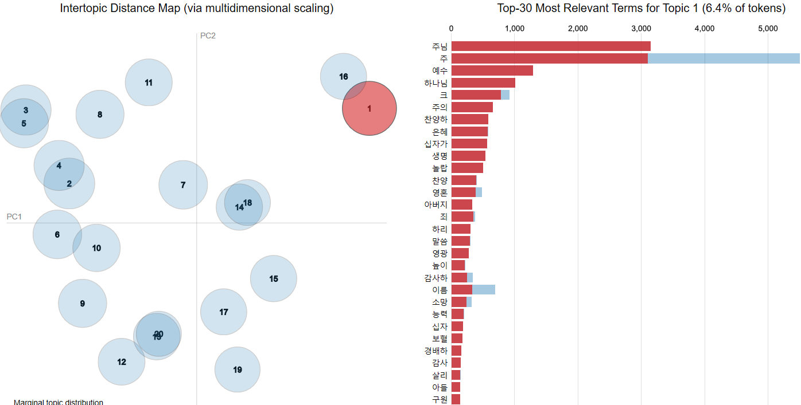
#### Topic 11 in LDA:
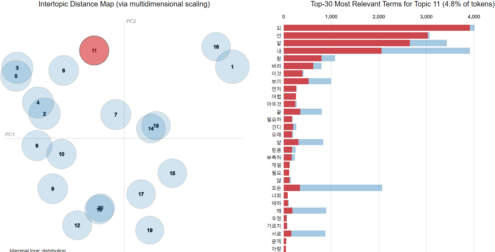
#### Topic 12 in LDA:
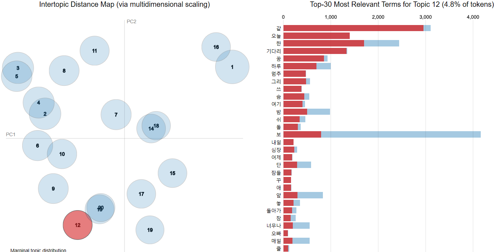
#### Topic 15 in LDA:
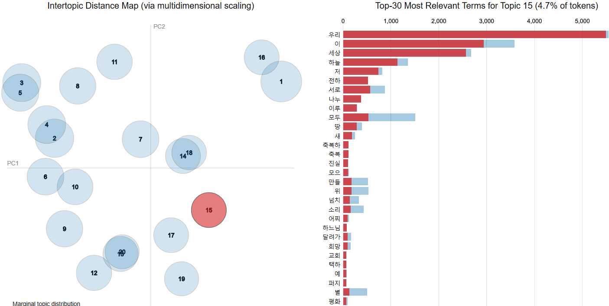
#### Topic 16 in LDA:
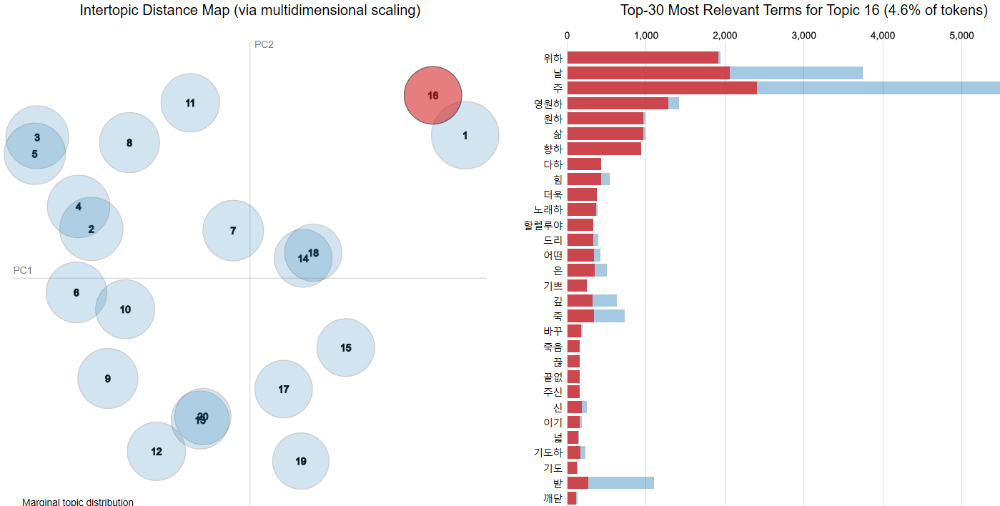
#### Topic 19 in LDA:
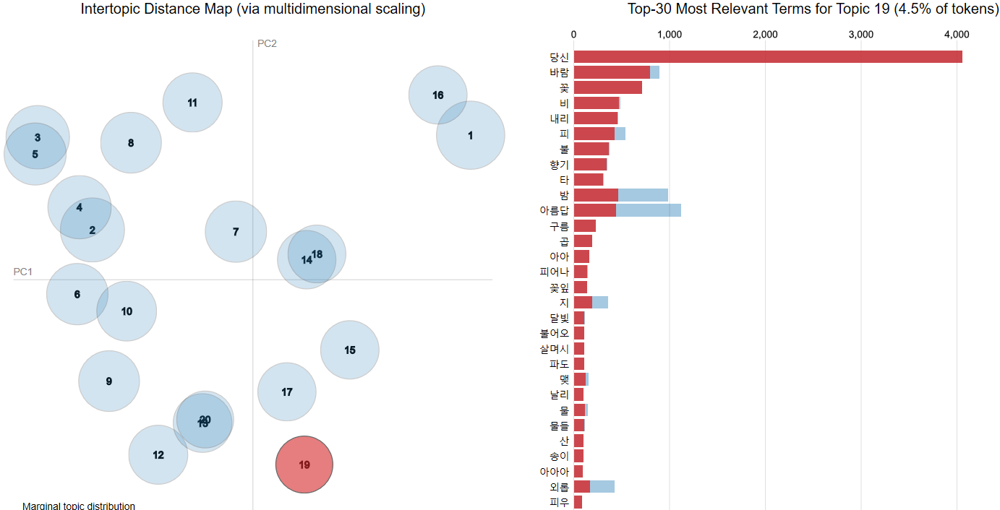
#### Topic 3 in LDA:
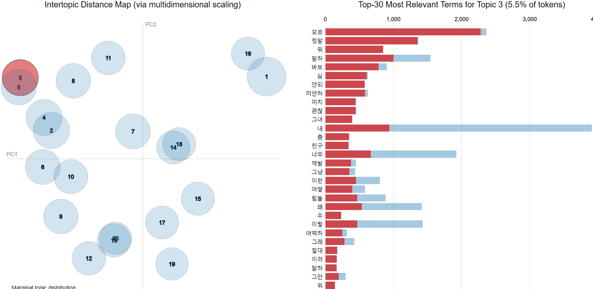
#### Topic 5 in LDA:
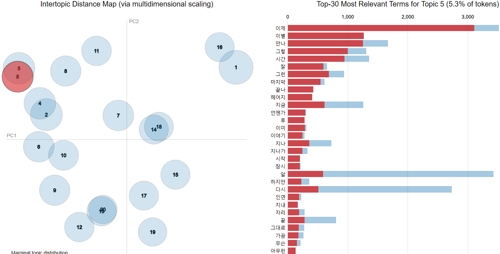
#### Topic 6 in LDA:
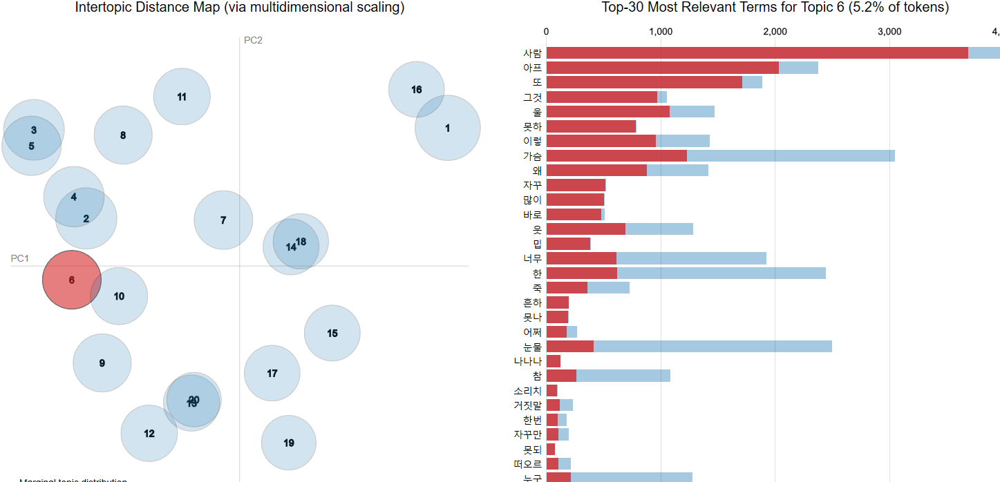
#### Topic 8 in LDA:
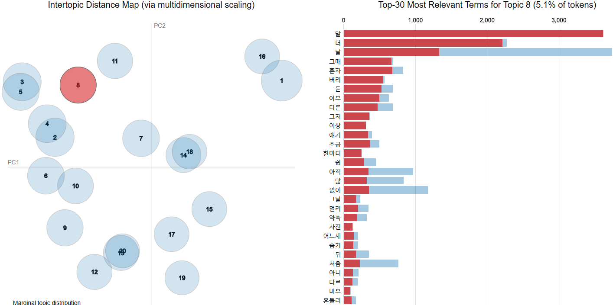

### STM:
#### total
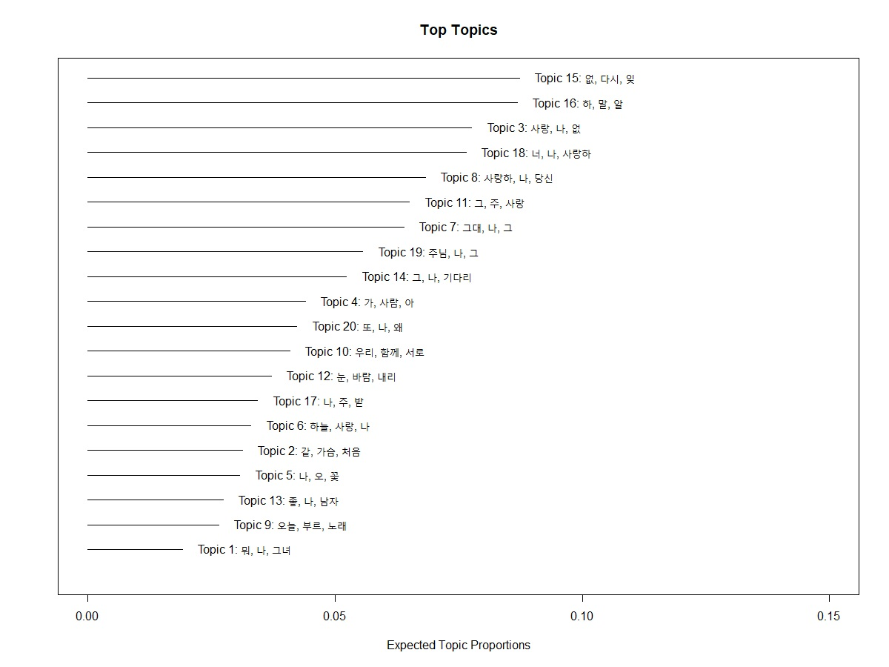
#### Topic 1~4 in STM
, 2(상우), 3(하좌), 4(하우)")
#### Topic 5~8 in STM
, 6(상우), 7(하좌), 8(하우)")
#### Topic 9~12 in STM
, 10(상우), 11(하좌), 12(하우)")
#### Topic 13~16 in STM
, 14(상우), 15(하좌), 16(하우)")
#### Topic 17~20 in STM
, 18(상우), 19(하좌), 20(하우)")

## CITEMENT

REFERENCE: **A study on the practicability of categorizing Korean popular songs by topic modeling (LDA& STM): based on lyrics with “love-centered” keywords since 1970s. 2020**
